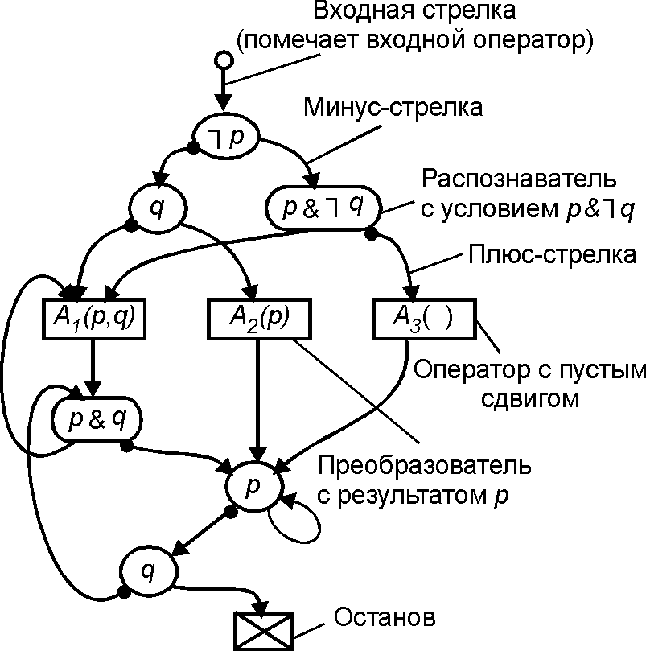

# Математические модели вычислений

## Альтернативные модели вычислений

### Клеточные автоматы
### Понятие «Тьюринг-полноты» в компьютерных языках
### μ-рекурсивные функции Клини
### Операторные схемы программ
### Схемы Янова

#### maxim.krivchikov@gmail.com

#### https://maxxk.github.io/formal-models/

# Клеточный автомат

Решётка («таблица» произвольной размерности) из ячеек, каждая из которых может находиться в конечном числе состояний.

На каждом шаге следующее состояние каждой ячейки определяется по заданному фиксированному правилу, которое может использовать текущее состояние ячейки и текущие состояния ячеек в некоторой окрестности.

Более строго:
1. Пространство ячеек C.
2. Конечный набор возможных состояний ячеек — Σ, |Σ| = k; ∀ c ∈ C, σ(c) ∈ Σ.
3. Понятие окрестности ячейки — N(c) — конечное множество ячеек из C. Для всех ячеек окрестность имеет один и тот же размер |N(c)| = n. Окрестность «взаимна» — для каждой ячейки d из окрестности ячейки c, c ∈ N(d).
4. Правило перехода φ : Σ^n^ → Σ.

На каждом шаге t правило перехода одновременно применяется к каждой ячейке с состояниями окрестности на предыдущий момент времени t-1. 

# Типы поведения автоматов
Классификация правил перехода Вольфрама:

**Класс 1.** Быстрая стабилизация состояния и его гомогенность.
**Класс 2.** Быстрая стабилизация состояния либо возникновение колебаний. Локальные изменения в начальных условиях оказывают локальный характер на дальнейший ход эволюции системы.
**Класс 3.** Почти все начальные условия приводят к псевдо-случайным последовательностям, стабильные структуры почти сразу уничтожаются окружающим шумом. 
**Класс 4.** Результатом эволюции почти всех начальных состояний являются структуры, которые взаимодействуют сложным образом с формированием локальных, устойчивых структур, которые способны сохраняться длительное время.

Некоторые клеточные автоматы демонстрируют поведение, достаточное для эмуляции машины Тьюринга.

*Литература: Клеточные автоматы: Stephen Wolfram. A New Kind of Science. Wolfram Media, Inc. 2007*

# Тьюринг-эквивалентные клеточные автоматы
1. [Игра «Жизнь» Конвэя](http://www.igblan.free-online.co.uk/igblan/ca/) ([и ещё одна схема](http://www.rendell-attic.org/gol/fullutm/index.htm))
2. «Rule 110» — одномерный клеточный автомат

Дополнительно:
1. [Эмулятор одномерного клеточного автомата](../ca1d/ca1d.htm) [(источник)](https://github.com/CodeDrome/cellular-automata-1d-javascript)
2. Эмулятор двумерного клеточного автомата: http://golly.sourceforge.net/
3. Эмулятор игры Тетрис в игре "Жизнь": https://codegolf.stackexchange.com/q/11880 
4. Универсальная машина Тьюринга в игре "Жизнь": http://rendell-attic.org/gol/utm/index.htm

# Rule 110
Из Wolfram MathWorld: http://mathworld.wolfram.com/Rule110.html

[Эмуляция машины Тьюринга правилом 110](https://wpmedia.wolfram.com/uploads/sites/13/2018/02/15-1-1.pdf)

# Эмуляция машины Тьюринга правилом 110

1. Машины Тьюринга можно эмулировать tag-системой Поста. Тэг-система Поста считывает по 2 (в общем случае — n) символов с начала ленты с данными, определяет на основе первого символа новую последовательность символов («дополнение») и дописывает её в конец ленты. 

2. Тэг-систему можно эмулировать циклической тэг-системой: на ленте могут быть только символы Y, N; программа задаётся зацикленной последовательностью дополнений; если считан символ Y, текущее дополнение дописывается в конец и машина переходит к следующему дополнению, если N — машина просто переходит к следующему дополнению.

3. Циклическая тэг-система эмулируется системами глайдеров — движущихся (по прямой) точек разного типа (тип задаёт направление движения), при столкновении которых из точки могут начать движение глайдеры другого типа.

4. Система глайдеров эмулируется правилом 110.

# Понятие «Тьюринг-полноты» в компьютерных языках

# Машины с регистрами
Машина с регистрами включает:
1. Неограниченное (как правило, конечное) количество именованных регистров, каждый из которых может содержать одно неотрицательное число неограниченного размера.
2. Набор меток.
3. Ограниченный набор инструкций, который может включать:
    1. Арифметические инструкции (Increment(r), Decrement(r), Clear-to-zero(r), Load-constant(r, k), Add, Subtract, ...)
    2. Управляющие инструкции (Copy(r~1~, r~2~), LoadAccumulator(r), StoreAccumulator(r))
    3. **Условный переход** (обязательно; как правило, по заданному регистру): Jump-if-zero, Jump-if-not-zero, Jump-if-equal, ...
    4. Операции непрямой адресации (Load-from-address(r), Store-by-address(r))
    5. Ввод-вывод
4. Регистр состояний — содержит текущую инструкцию и её адрес в программе.
5. Список инструкций с метками (как правило, последовательный).

Классы: машины со счётчиками, машины с указателями, машины с памятью с произвольным доступом, машины с памятью с произвольным доступом с программой в регистрах (архитектура фон Неймана)

# «Аппаратные» реализации

1. URISC (Ultimate Restricted Instruction Set Computer) — машина с одной инструкцией. Для того, чтобы иметь возможность эмулировать машину Тьюринга, память должна быть бесконечной, а адреса и ячейки — произвольными целыми числами (возможно, неотрицательными)
    - `subleq a, b, c` — посчитать `M[b] - M[a]`, записать в `M[b]` и, если `b ≤ 0` перейти на адрес `c`. В памяти хранятся тройки `a, b, c`
    - `dln a, b` — уменьшить на 1 значение `M[a]`; если получился `0`, перейти по адресу `b`

2. Механизм защиты памяти в x86-процессорах допускает реализацию `subleq` с помощью вложенных исключений page fault

3. Magic: The Gathering (и другие примеры на странице [Accidentally Turing-complete](http://beza1e1.tuxen.de/articles/accidentally_turing_complete.html))

# μ-рекурсивные функции Клини

Частично-рекурсивные функции на натуральных числах.
## Функции

1. k-арные константные функции K^k^~n~.

K^k^~n~(x~1~, …, x~k~) = n

2. 1-арная функция увеличения на 1

S(x) = x + 1

3. Функции проекции P^k^~i~
P^k^~i~(x~1~, …, x~k~) = x~i~

## Операторы
1. Оператор подстановки ∘ для m-арной функции h и m k-арных функций g~i~ определяет k-арную функцию

h ∘ (g~1~, …, g~m~) = f(x~1~, …, x~k~)

f = h(g~1~(x~1~, …, x~k~), …, g~m~(x~1~, …, x~k~))

# μ-рекурсивные функции Клини
## Операторы
2. Оператор примитивной рекурсии («цикл») $ρ(g, h)$ по k-арной функции $g$ (база индукции) и k+2-арной функции h (шаг индукции) определяет k-арную функцию $f$:

f(0, x~1~, …, x~k~) = g(x~1~, …, x~k~)

f(y+1, x~1~, …, x~k~) = h(y, f(y, x~1~, …, x~k~), x~1~, …, x~k~)

Первые два аргумента h — число итераций и результат предыдущей итерации. 

3. Оператор минимизации $μ$ для k+1-арной полной функции f возвращает k-арную частичную функцию, которая находит минимальное значение первого аргумента $z$, при котором f(z, x~1~, …, x~k~) = 0:

μ(f)(x~1~, …, x~k~) = z : f(z, x~1~, …, x~k~) = 0; f(i < z, x~1~, …, x~k~) > 0

[Компилятор подмножества😕 рекурсивных функций в машину Тьюринга](http://people.irisa.fr/Francois.Schwarzentruber/recursive_functions_to_turing_machines/)

# Операторная схема программы
Классический советский подход к теории программирования, предложенный А.А. Ляпуновым в первом курсе «Принципы программирования», который он читал в 1952/53 году на кафедре вычислительной математики.

В более позднем определении А.П. Ершова:

Задано конечное множество *операторов* F = { F~1~, …, F~n~}. Входы и выходы описываются в терминах *полюсов* операторов P = A ∪ R — объединение непересекающихся множеств *аргументов* A = {a~1~, …, a~p~} и *результатов* R = { r~1~, …, r~q~ }. *Распределение полюсов* — отображение V : P → F.

*Граф переходов* — ориентированный граф C = (F, J), где J — бинарное отношение, задающее для оператора его преемников по передаче управления.
Компоненты связности графа переходов — отдельные программы в программном комплексе.

*Скелет* программы — набор перечисленных множеств S = (F, C, A, R, V).

*Память* описывается множеством X = { x~1~, …, x~m~ } и распределяется среди полюсов отображением L : P → X.

Операторная схема программы — набор G = (S, X, L).

# Задача экономии памяти

А.П. Ершов в книге (ссылка ниже) рассматривает задачу экономии памяти: каким образом можно использовать минимальное множество памяти X, сохраняя семантику программы?

Постановка задачи: по заданной схеме программы с *распределением памяти* L построить новое распределение памяти L', использующее, по возможности, память меньшего объёма.

А. П. Ершов. Введение в теоретическое программирование: беседы о методе. М.: Наука, 1977. 288 С.

# Задача экономии памяти

*Информационный граф* I = (P, M) — двудольный граф M ⊂ R×A, который сопоставляет результаты оператора с аргументами его преемников. *Маршрут информационной связи* — путь в информационном графе, задаётся первым результатом и последним аргументом.

Компоненты связности информационного графа называются *областями действия*.

Области действия *несовместимы* тогда и только тогда, когда в каждой из них найдутся результаты r и r', соответственно, такие, что:

  * V(r) = V(r') или
  * V(r) — внутренний оператор маршрута информационной связи (r', a')
  * V(r') — внутренний оператор маршрута информационной связи (r, a)

Задача экономии памяти решается выделением несовместимых областей действия раскраской графа и объединением совместимых областей действия.  

# Схема Янова
Модификация операторной схемы программ.
Область приложения — исследование способов задания условий в программе и эквивалентных преобразований программ с условиями.

Не рассматривается понятие памяти и распределения памяти. Все операторы одноместны, принимают на вход исходное состояние памяти и возвращают полностью изменённое состояние. 

Вводятся счётные множества *предикатных символов* **P** = { p~1~, p~2~, … } и *операторных символов* **A** = { A~1~, A~2~, … }.  

*Оператор* A = A(P) — пара из операторного символа A и некоторого (возможно, пустого) множества предикатных символов P, которое называется *сдвигом* оператора A.

# Схема Янова
*Граф переходов* — ориентированный граф, множество вершин которого состоит из неотрицательного числа *преобразователей*, *распознавателей* и одного *останова*. Из преобразователя выходит в точности одна дуга, из распознавателя — две различные (*плюс-стрелка* и *минус-стрелка*). Выделяется одна *входная* вершина графа и помечается *входной стрелкой*.

*Преобразователи* помечены операторными символами, *распознаватели* помечены логическими формулами над *предикатными* символами.

*Схема Янова* G(p~1~, …, p~k~) 

# Схема Янова

# Семантика схемы Янова
Для того, чтобы схема задавала программу, необходимо дать *интерпретацию* операторным и предикатным символам, и описать алгоритм выполнения интерпретированной схемы.

Дано некоторое множество *состояний памяти* D. 
Предикатные символы p~i~ соответствуют предикатам π~i~ : D → { **f**, **t** }. Сами p~i~ в программе назовём *предикатными переменными*. 

Операторным символам A~j~ сопоставляются (возможно, частичные) функции φ~j~ : D → D

# Выполнение схемы Янова

**Начальный шаг.** Берём произвольное d ∈ D в качестве исходного состояния памти и присваиваем значения всем предикатным переменным p~i~ ≡ π~i~(d). Передаём управление на входную вершину графа переходов. 

**Шаг выполнения.** Пусть d — текущее состояние памяти, Δ = (σ~1~, …, σ~k~) — текущие значения предикатных переменных, S — текущая вершина графа переходов.

1. Если S — останов, то выполнение завершается, и d является результатом выполнения схемы в данной интерпретации.
2. Если S — распознаватель с условием F(p~1~, …, p~k~). Вычисляем σ = F(Δ) и передаём управление по плюс-стрелке, если σ=**t** и по минус-стрелке, если σ=**f**.
3. Если S — преобразователь A~j~(P~j~), вычисляем новое состояние памяти d' = φ~j~(d) и значения предикатных переменных в  сдвиге P~j~ : p~i~ ≡ π~i~(d'). Управление передаётся на следующую вершину графа.

Таким образом, получена частичная функция d = **F**~G,I~(d~0~).

# Эквивалентность схем
Схемы G~1~ и G~2~ *сравнимы*, если они заданы над одним и тем же множеством предикатных символов, а также у одинаковых операторов совпадают сдвиги.

Две сравнимые схемы *эквивалентны* в некоторой совместной интерпретации I, если F~G1,I~(d) = F~G2,I~(d).

Две сравнимые схемы *функционально эквивалентны*, если они эквивалентны в любой совместной интерпретации.

*Операционная история* (след) интерпретированной схемы Янова H~G,I~(d) — полная последовательность выполняемых операторов и наборов значений функциональных переменных. Для исключения циклов вершины графа помечаются наборами значений предикатных переменных. Если при выполнении мы попали в вершину, помеченную таким же набором значений, что и текущий набор Δ, считаем, что мы попали в бесконечный цикл.

Две сравнимые схемы *операционно эквивалентны*, если они одинаково работают в любой совместной интерпретации, т.е. 
H~G1,I~(d) = H~G2,I~(d).

**Теорема.** Функциональная эквивалентность равносильна операционной эквивалентности.
 
# Эквивалентность схем
*Конфигурации* схемы k ∈ K(G) строятся аналогично операционным историям, но без заданной интерпретации индуктивно:

**Начальный шаг.** Выберем произвольный набор исходных значений предикатных переменных Δ. 
**Очередной шаг.** Текущий набор Δ, текущая вершина S. Уже обработанные вершины помечены.

1. Если S — помеченный распознаватель, то мы попали в пустой цикл и конфигурация не может быть построена.
2. Если S — непомеченный распознаватель с условием F, помечаем его, вычисляем F(Δ) и переходим к вершине-преемнику.
3. Если S — останов, построение конфигурации завершено.
4. Если S — оператор, то записываем A~i~ в конфигурацию, и в качестве нового значения Δ' помещаем произвольный набор, образующий с набором Δ допустимую пару для оператора A~i~.

Две сравнимые схемы *формально эквивалентны*, если их множества их конфигураций совпадают.

**Теорема.** Функциональная эквивалентность равносильна формальной эквивалентности. 

# Эквивалентные преобразования

**Теорема.** Для любых двух эквивалентных схем Янова можно построить последовательность эквивалентных преобразований, которые приводят их к общему виду.

**Теорема.** Задача эквивалентности двух сравнимых схем Янова разрешима.

Подловченко Р. И. К вопросу об эквивалентных преобразованиях алгоритмов и программ // Математические вопросы кибернетики. Вып. 9. — М.: Физматлит, 2000. — С. 25–36. URL: http://library.keldysh.ru/mvk.asp?id=2000-25

# Задачи

**Задача 3.1\***
~ реализуйте интерпретатор $μ$-рекурсивных функций Клини с возможностью пошагового выполнения.

**Задача 3.2\*\***
~ реализуйте проверку числа на простоту в терминах μ-рекурсивных функций Клини.

**Задача 3.3\***
~ реализуйте интерпретатор произвольных клеточных автоматов с "квадратными" клетками, в качестве примера покажите работоспособную реализацию игры "жизнь".

**Задача 3.4\*\*\***
~ предложите возможные способы задания системы типов, не допускающей задание незавершимых функций, для клеточных автоматов или для μ-рекурсивных функций Клини (текст, от 5 страниц A4, шрифт 14пт, междустрочный интервал 1.5). 

**Задача 3.5\*\***
~ опишите в терминах схем Янова один из алгоритмов сортировки списка и докажите его корректность.
