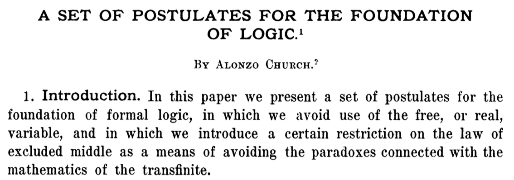
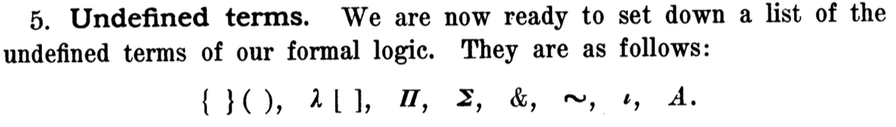

# Математические модели вычислений

## λ-исчисление Чёрча. Рекурсивные комбинаторы и парадоксы.

## λ-исчисление с простыми типами. Свойство сильной нормализации.
<style>
span.math {
    letter-spacing: 0.15em;
    word-spacing: 0.2em;
}
</style>

maxim.krivchikov@gmail.com

https://maxxk.github.io/formal-models/

# (Нетипизированное) λ-исчисление Чёрча (1932)
— изначально было предложено в качестве формальной системы для оснований математики.

Вычисления представлены в виде последовательности подстановок значений переменных в выражения.

Пример: $f(x) = x + 3 / x$ в λ-исчислении:

$$ λ x . (x + 3) / x $$
— функция от аргумента $x$, значение которой равно $(x+3)/x$.

Вызов $f(2)$:

$$ (λ x . (x + 3) / x) · 2 $$

— подставить 2 вместо $x$ в выражение $(x+3) / x$:

$$ (λ x . (x + 3) / x) · 2 ⟶ (2 + 3) / x ⟶ (2 + 3) / 2 $$

# Строгое определение
Рассмотрим формулы, составленные из выражений вида:
1. $x, y, z, …$ — переменная
2. $λ x . F$ — абстракция ($x$ — имя переменной, которая может встречаться в формуле $F$)
3. $A · B$ — приложение (применение, аппликация), $A, B$ — формулы. Оператор «·» левоассоциативен (A · B · C = (A · B) · C).

Правило подстановки ($β$-редукция):
$$ ( λx. F ) · G ⟶_β F[x := G] $$ 

Буква $α$ зарезервирована для понятия $α$-эквивалентности — формулы, эквивалентные с точностью до переименования переменных:

$λ x . x =_α λ y . y$

Переменная, перед которой стоит соответствующая абстракция называется *связанной*, в противном случае — *свободной*:

$λ x. x · y $ — x связана, y свободна.

Вычисление считается завершённым когда нет $β$-редексов (подформул, к которым применима $β$-редукция)

# Индексы де Брёйна (de Bruijn, де&nbsp;Браун) {.debruijn}
Чтобы избавиться от $α$-эквивалентности, вместо имён переменных можно использовать числа числа — глубину терма:

{ width=60% }

# Примеры

1. Нумералы Чёрча — представляем натуральное число $n$ как $n$-кратное применение функции:
$0 ≡ λf.λx. x$
$1 ≡ λf.λx. f · x$
$2 ≡ λf.λx. f·(f·x)$
...

2. Композиция функций:
$f ∘ g ≡ g(f(x)) ≡ λf.λg.λx. g · (f · x)$

3. $Ω ≡ (λ x. x · x) · (λ x . x · x )$ — редукция этого терма уходит в бесконечный цикл. 

# Оригинальная формулировка Чёрча

Church A. A Set of Postulates for the Foundation of Logic // The Annals of Mathematics. 1932. Vol. 33, № 2. P. 346–366.


# Оригинальная формулировка Чёрча {.left}
**{ } ( )**
~ применение (чтобы проще выделять левую и правую части)

**λ []**
~ абстракция

**Π(F, G)**
~ **G**(x) выполняется для всех значений, для которых выполняется **F**(x)

**Σ(F)**
~ существует значение *x*, для которого верно **F**(*x*)

**&**
~ конъюнкция

**~**
~ отрицание (¬)

***ɩ*** **(F)**
~ такое x, что F(x) верно

**A(F, M)**
~ «абстракция M относительно F», дизъюнкция, используется для определения классов в стиле Principia Mathematica

# Комбинаторная логика
M. Schönfinkel (1924), H. Curry (1930)
Формальная система, синтаксис которой состоит из переменных, парных скобок и *комбинаторов* (правил преобразования строк символов). Эквивалентна машине Тьюринга, близко связана с $λ$-исчислением (может считаться «синтаксическим сахаром» для λ-исчисления)

- **S** x y z = x z (y z) — распределение
- **K** x y = x — отмена
- (**S, K** — базис, из них можно получить остальные комбинаторы)
-  **I** x = x — идентичность
-  **D** x = x x — дублирование
-  **C** x y z = x z y — перестановка
-  **B** x y z = x (y z) — композиция
- **W** x y = x y y — копирование
- **Y** x = x (**Y** x) — неподвижная точка

# Y-комбинатор 
Y-комбинатор — примитивный комбинатор рекурсии. Принимает на вход функцию двух аргументов, первый из которых — «рекурсивный вызов», а второй — входные данные для функции:

$$ Y = λ f . ( λ x . f (x · x)) · (λ x . f (x · x)). $$

Если вместо переменных использовать $λ$-абстракцию и арифметические выражения, наивная реализация факториала могла бы выглядеть следующим образом:
```
Fact := Y (λ fact. λ x.
    if (x == 0) return 1
    else return x*fact(x - 1))
```

$$ Yx = x · (Yx) $$

«Тип» Y-комбинатора: ((T → T) → T → T) → T → T.

# Парадокс Карри
1935 (Клини, Россер), 1941 (Карри), 1942 (Карри)
Если дана формальная система, удовлетворяющая следующим свойствам:
- конечное число примитивных термов, единственная операция — бинарная операция применения, единственный унарный предикат — предикат выводимости «⊦ A»
- определено равенство в терминах примитивного терма Q и применении (X = Y ≡ ⊦ Q · X · Y)
- равенство симметрично, транзитивно, сохраняется при применении и подразумевает взаимную выводимость (A = B, A ⊦ B)
- для любого терма $M$ со свободными переменными $X_1, …, X_n$ существует терм $M^*$, такой, что $M^* · X_1 · … · X_n = M$
- может быть определён оператор импликации $→$, такой, что для любых термов $M, N$:
    > - ⊦ M → M
    > - ⊦ (M → (M → N)) → (M → N) 
    > - ⊦ M и ⊦ M → N ⟹ ⊦ N
...

# Парадокс Карри
...то любой терм ξ выводим с помощью следующего построения:
1. Положим φ ≡ Y (λ x . x → (x → ξ))
2. ⊦ φ = (φ → (φ → ξ)) по определению Y
3. ⊦ φ = (φ → (φ → ξ)) → (φ → ξ) по определению Y
4. п. 3 — аксиома импликации, поэтому ⊦ (φ → (φ → ξ)) → (φ → ξ)
5. φ → (φ → ξ) (подставляем равенство из шага 2)
6. ⊦ φ Опять подставляем равенство из шага 2
7. По MP получаем φ → ξ и наконец ξ.

Основная идея — если формальная система допускает неограниченный оператор рекурсии (неподвижной точки), то она противоречива. Это справедливо для любой формальной системы, эквивалентной комбинаторной логике или λ-исчислению.

# Principia Mathematica
B. Russel, A. Whitehead. 1910 – 1913 (3 тома).
— фундаментальный труд по формализованным основаниям математики.

В книгах используется слегка отличающаяся от современной логическая нотация, но в целом их достаточно легко понять.
Авторы (до результатов Гёделя) пытались описать математику с позиций формализма и в этом преуспели.

Для того, чтобы преодолеть парадокс Рассела, предлагалось рассматривать объекты как принадлежащие к некоторым *типам*. Типы определяются как область истинности некоторого утверждения.

. . .

При изучении функций комплексного переменного, мы не пытаемся подставить вместо аргумента, например, бесконечномерный оператор. Все утверждения формируются с подразумеваемым условием «x — комплексное число».
Типы позволяют избавиться от циклических определений.

# λ-исчисление с простыми типами
1940 (Чёрч); далее представлено определение, ближе к современной записи.
http://plato.stanford.edu/entries/type-theory-church/

Пусть дано множество базовых типов B, * ∈ B

Допустимые типы:
$$ τ ≡ b \; | \; τ_1 → τ_2, \qquad b ∈ B. $$
Стрелка — правоассоциативна:
α → β → γ ≡ α → (β → γ)

Сокращение: α' ≡ α → α

- \* — «тип типов», тип высказываний

- У Чёрча — в обратном порядке и без стрелок (α → β → γ ≡ (γβα))

# λ-исчисление с простыми типами
В оригинальной формулировке формулы:
- Символы λ, [, ] для описания абстракции
- Переменные $a_α$, $b_α$, … типа α
- Логические константы :
    - $¬_{* → * }$ отрицание  
    - $∨_{* → * → * }$ дизъюнкция,  
    - $Π_{(α → * ) → * }$ универсальная квантификация,
    - $i_{(α → * ) → α}$ оператор выбора
- Константы произвольных типов α

# λ-исчисление с простыми типами

Современная формулировка исчисления (только вычислительная часть) не содержит логических констант и типа * (точнее, * — это «тип всех типов», но не входит в константу τ)

Грамматика:
- Абстракция (записывается как $λ x_α [ A_α ]$)
- Приложение
- Константы и переменные

У Чёрча индексы типов обязательны, но мы будем их пропускать, если это уместно и использовать отношение типизации.

# Отношение типизации {.left}
**Окружение типизации** Γ — конечный набор высказываний $x : α$ (x имеет тип α), где $x$ — символ переменной, а $α$ — тип.
[] — пустое окружение, $x : α ∈ Γ$ записывается как суждение $Γ ⊦ x : α$ (из окружения выводимо, что x имеет тип α).
$Γ, x : α$ — окружение Γ, расширенное суждением $x : α$.

Расширенная грамматика и правила вывода исчисления задаются в терминах таких суждений — правил типизации (и известного нам правила β-редукции)

- T-Const $c_α$ — константа типа $α ⟹ Γ ⊦ c : α$, включая логические константы, если мы их рассматриваем

- T-Abs $Γ, x : σ ⊦ e : τ ⟹ λx_σ.e : σ→τ$, обычно абстракция записывается как $λ x : σ . e$

- T-App $Γ⊦x : σ→τ,  Γ⊦y : σ ⟹ Γ⊦x_{σ → τ}·y_σ : τ$

Допустимы только типизируемые формулы, т.е. те, для которых из данного окружения можно вывести тип.

# Аксиомы и правила вывода {.left}
$(λ x . F) · G ⟶_β F[G/x]$
~ β-редукция <!--_ -->

Если используются логические константы, то импликация, как в алгебре логики:
 $A_o ⊃ B_o ≡ (¬A)∨B$ и Modus Ponens (A ⊃ B, A ⟹ B)
(1) $[p_* ∨ p_*] ⊃ p_*$
(2)	$p_* ⊃ [p_* ∨ q_*]$
(3)	$[p_* ∨ q_*] ⊃ [q_* ∨ p_*]$
(4)	$[p_* ⊃ q_*] ⊃ [[r_* ∨ p_*] ⊃ [r_* ∨ q_*] ]$
(5^α^) $Π_{(α → *) → *} f_{α → *} ⊃ f_{α→*} x_α$
(6^α^)	$∀x_α[p_* ∨ f_{α → *} x_α] ⊃ [p_* ∨ Π f_{α→*}]$ <!--* -->
(и еще несколько аксиом в оригинале)

# Естественная дедукция
τ ≡ b | α → β

Правила типизации, используемые для определения типов, можно структурировать (следующая структура носит название «естественная дедукция», natural deduction):

**формация** (Formation) — как определяется конструктор типа
~ $α, β — типы  ⟹  α→β — тип$

**введение** (Introduction) — как определяются элементы типа
~ $Γ, x:σ ⊦ e:τ ⟹ λx_σ.e : σ→τ$

**удаление** (Elimination) — что можно делать с элементами типа, чтобы получить элементы некоторого другого типа
~ $Γ ⊦ x : σ → τ, Γ ⊦ y : σ ⟹ Γ ⊦ x_{σ→τ} · y_σ : τ$, $x$ — удаляемый терм

**редукция** (Reduction) — взаимное уничтожение термов введения и удаления (не входит в обычное понятие естественной дедукции)
~ $[λ x . F] · G ⟶_{β} F[G/x]$ <!--_ -->

# Соответствие Карри-Ховарда λ-исчисления с простыми типами
Типы можно рассматривать как импликативные суждения (α → β — импликация). Доказательства — термы, имеющие этот тип.
Если ввести тип ложных высказываний как базовый тип False без правил введения и с термом удаления ex falso:

$$ exfalso_τ(f : False) : τ $$ 

, то можно ввести и отрицание — «не α» ≡ α → False.

# Свойства типизированного λ-исчисления
- сохранение типизации правилами редукции ($x : α ⟶ y : α$)
- теорема Чёрча-Россера: β-редукция конфлюэнтна (верно и для нетипизированного исчисления)
  правила редукции можно применять в разном порядке (λ x . f · (g · x))
  Формулировка: если $x ⟶^* y$ и $x ⟶^* z$ с помощью разной последовательности применения правил редукции, то существует терм $w$, для которого $y ⟶^* w$ и $z ⟶^* w$.
  Результат не зависит от порядка вычисления.
  
  «свойство ромба»
  

# Схема доказательства теоремы Чёрча-Россера
(Тэйт, Такахаши)

1. Определяем отношение параллельной редукции $>>$ (Тэйт):

pr-refl: x >> x

pr-β: a >> a', b >> b' 

⟹ (λu . a) b >> a'[u := b']

pr-ξ: a >> a'

⟹ λ u . a >> λ u . a'

pr-app: a >> a', b >> b'

⟹ a · b >> a' · b'

Оно рефлексивно и параллельно, но содержит недетерминированный выбор pr-β / pr-app (ветвление).

2. Определим стратегию «максимальной» параллельной редукции $>>>$ (Такахаши):

cd-var, cd-β, cd-ξ идентичны pr-refl, pr-β, pr-ξ.

cd-app: к pr-app добавляется условие того, что a — не абстракция, тем самым «максимальная» редукция детерминирована.

Заметим, что отношения >> и >>> выполняют однократную подстановку для всех редексов, которые есть в формуле (но не для новых редексов).

# Схема доказательства теоремы Чёрча-Россера

3. Лемма. Отношения >> и >>> корректно определены.
4. Лемма (нетривиальная). Для любого a, b, d: a >>> d и a >> b ⇒ b >> d.
По индукции вывода a >>> d рассматриваем все возможные варианты b, такого, что a >> b.
5. Лемма. Отношение >> обладает свойством ромба.
6. Следствие. Транзитивное замыкание $>>^*$ обладает свойством ромба.
7. Следствие. a $>>*$ b ⇔ a $→^*_β$ b. 

# Нормализация
**Редекс** — терм удаления, к которому можно применить правило редукции.
**Нормальная форма** терма относительно редукции — это такой вид, при котором к нему неприменимы правила редукции.
**Головная нормальная форма** терма — если в головной позиции (корне дерева) не стоит редекс.

**Нормализация** — свойство формальной системы: если у терма есть нормальная форма, то она единственная.
**Сильная нормализация** — у всех термов есть единственная нормальная форма (= нет термов, редукция которых не завершается).

# Безопасность типов
С позиций программирования, типы должны обеспечивать следующие свойства корректно типизированных программ:
1. Определим множество «канонических» (простых) форм для типов. Каноническая форма — это значение, записанное в явном виде:
    - $1$ — это каноническая форма натурального числа;
    - $(λ x_ℕ . x) · 1$ — это не каноническая форма натурального числа;
    - $1 · 1$ — это некорректно типизированное выражение.
2. (Progress) Любой корректно типизированный терм $t : T$ без свободных переменных или находится в канонической форме, или является редексом.
Доказательство — по индукции вывода типа. Нетривиальный случай — применение T-App.

3. (Preservation) Редукция сохраняет тип, т.е. если $t : T$ и $t ⟶ t'$, то $t' : T$.
Доказательство — по индукции по выводу типа. 
Для случая подстановки нужно доказать, что операция подстановки сохраняет типизацию. 
Для этого, в свою очередь, нужно показать, что типизация сохраняется при изменениях в контексте, которые не изменяют значения свободных переменных.

4. Безопасность типов: если вычисление любого корректно типизированного терма завершается, то результатом вычисления является каноническая форма.   

# Схема доказательства сильной нормализации λ-исчисления с простыми типами


# Эквивалентность термов
Обычно определяется следующим образом: A эквивалентен B, если A и B приводятся β-редукцией к идентичному виду, с точностью до корректных (без конфликтов имён) переименований переменных. На индексах де Брёйна последнее замечание неактуально.

## η-эквивалентность
Пусть $f : α → β$. Тогда $λ (x : α). f · x$ интуитивно эквивалентен исходной $f$, но по указанному выше определению формально это разные термы.

η-эквивалентность включает такое понятие и, в случае просто типизированного λ-исчисления, не нарушает разрешимости эквивалентности типов.

**Проверка типов разрешима** — если есть алгоритм, который для любого терма определяет, корректно ли он типизирован.
**Эквивалентность термов разрешима** — если есть алгоритм, который для любой пары термов определяет, эквивалентны ли они при заданных правилах.

# Не все утверждения удобно представимы в λ-исчислении с простыми типами
В частности, для нумералов Чёрча представимый класс называется «расширенные полиномы» над ℕ:
- 0, 1, проекции
- сложение, умножение
- функция `ifzero`(n, m, p) = `if` n = 0 `then` m `else` p

В следующий раз мы рассмотрим различные способы расширения набора типов и постараемся убрать разделение между типами и термами.


# Задачи
**Задача 5.1. \*** 
~ Определить умножение и сложение для нумералов Чёрча.

**Задача 5.2. \*\***
~ Показать, что, хотя для некоторого базового типа $T$ нумералы Чёрча и их умножение и сложение типизируемо, нельзя определить операцию вычитания нумералов в λ-исчислении с простыми типами.

**Задача 5.3а. \*\*\***
~ Построить машину Тьюринга, которая делает β-редукцию.

**Задача 5.3б. \*\*** 
~ Предложить схему эмуляции работы универсальной машины Тьюринга в нетипизированном λ-исчислении.
